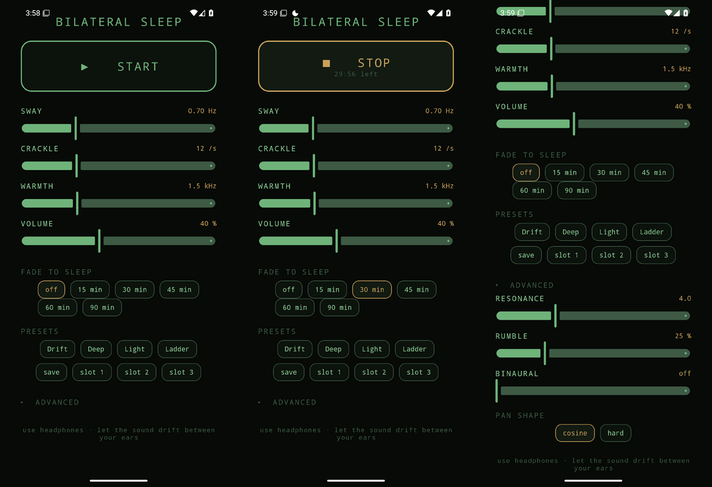

# Bilateral Sleep

A real-time bilateral sleep-induction audio generator. A *Jacob's ladder / electric
arc* crackle (Poisson clicks through a resonant bandpass) over a brown-noise bed,
swung left↔right by a slow, sub-audible **equal-power pan LFO** — the sleep lever.
Nothing is pre-rendered; audio is synthesised continuously and can run for hours.

Two front-ends share **one identical DSP algorithm**:

| | |
|---|---|
| `desktop/` | Linux reference tool — `numpy` + `sounddevice`, full CLI. |
| `android/` | Autism-friendly Android app (dimmed-phosphor UI), packaged as an APK. |



<sup>Real screenshots: **idle** · **playing** (amber STOP + live sleep-timer countdown, silent service running) · **advanced** (resonance / rumble / binaural / pan shape). Dimmed-phosphor, fully static — no flashing or animation.</sup>

## Architecture (carrier vs envelope, kept strictly separate)
- **Carrier** (in-band, what the driver reproduces): Poisson clicks → RBJ resonant
  bandpass (`carrier-center`, `carrier-q`) layered over a brown-noise bed.
- **Envelope** (sub-audible, never emitted as a tone): an equal-power (cosine-law)
  pan LFO alternates the whole carrier L↔R at `alt-rate` (default 0.7 Hz). Center
  crossings stay at 0.707/0.707 — no loudness dip.
- **Binaural** (optional): faint 200 Hz L / (200+N) Hz R sines under the crackle.

All filter / RNG / phase state carries across buffer boundaries, so there are no
clicks at the seams and nothing reseeds per block.

## Desktop
```bash
cd desktop
python bilateral_sleep.py                 # defaults: 0.7 Hz sway, 12 clicks/s, 1.5 kHz
python bilateral_sleep.py --alt-rate 0.5 --crackle-density 8 --carrier-center 900
python bilateral_sleep.py --binaural-hz 4 # add a faint 4 Hz binaural beat
python test_dsp.py                         # headless DSP checks (no audio device needed)
```
Knobs: `--alt-rate --crackle-density --carrier-center --carrier-q --brown-level
--pan-shape {cosine,hard} --volume --samplerate --binaural-hz` (+ `--blocksize --device`).

## Android
Autism-friendly by design: dimmed-phosphor palette, **no flashing or animation**,
gentle ~1.5 s fades on every start/stop/volume change, a sleep timer with a slow
60 s fade-to-silence, named presets + plain-language labels, and a silent,
no-vibrate, ongoing service notification (the one OS-mandated exception).

Build:
```bash
cd android
ANDROID_HOME=~/Android/Sdk ./gradlew assembleDebug
# -> app/build/outputs/apk/debug/app-debug.apk
```

Headphones recommended — the bilateral swing is the point.
